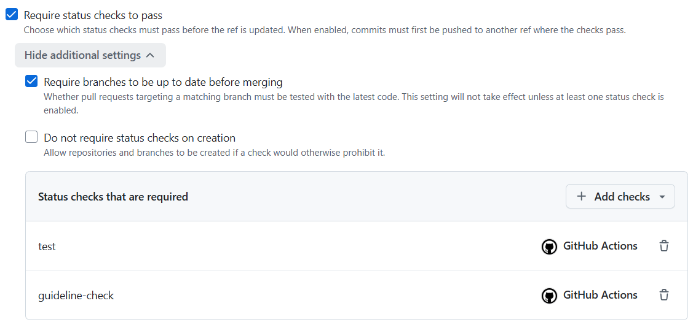
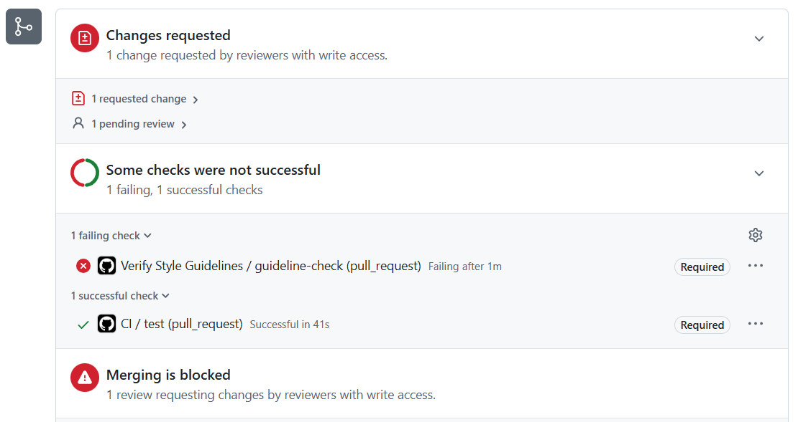
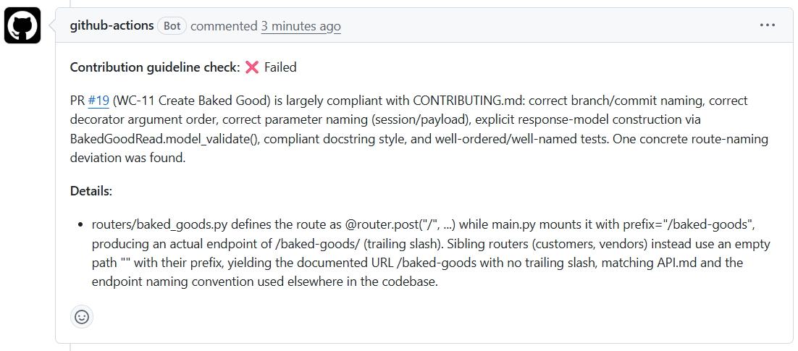
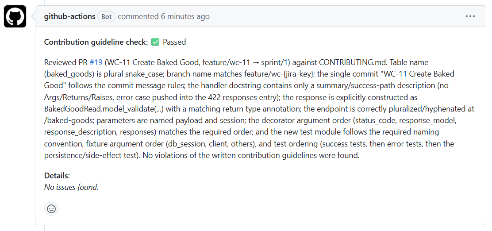
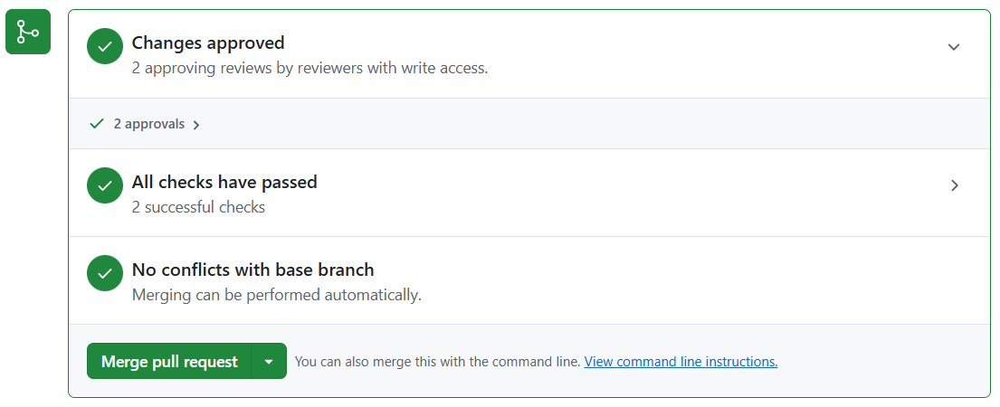

<!-- _class: center -->

# Continuous Integration with GitHub

Bryan Verble
August 18, 2026

[github.com/bverble-catalyte/ci-presentation](https://github.com/bverble-catalyte/ci-presentation)

---

# What is Continuous Integration?

- There is no single definition (ThoughtWorks, [No One Agrees How to Define CI or CD](https://www.gocd.org/2017/05/09/continuous-integration-devops-research.html))

## The Narrow View

- CI is the process of integrating changes multiple times per day on a shared mainline, made possible by an automated build/test system.
- Less common, but strongly defended in XP/CD literature (Beck, Fowler, Farley)

## The Broad View

- CI is the use of an automated build/test system, regardless of your actual strategy for integrating changes.
- Most common view


---

# What Can Continous Integration Do?

## Quite a Lot!

- Run test suites
- Enforce formatting standards
- Check for possible errors or idiom violations (linting)
- Automatic LLM code review

## Our Team Uses Each of These

- `pytest --cov` for integration tests and coverage checks
- `ruff check` for linting
- `ruff check --format` for format checking
- `claude-code-action` for more general style checking

---

# Test Coverage

```shell
$ pytest --cov
Name                                         Stmts   Miss  Cover
----------------------------------------------------------------
src\wyrmwood_coffee\__init__.py                  0      0   100%
src\wyrmwood_coffee\database.py                 23      9    61%
src\wyrmwood_coffee\dependencies.py              5      0   100%
src\wyrmwood_coffee\main.py                     22      3    86%
src\wyrmwood_coffee\models\__init__.py           2      0   100%
src\wyrmwood_coffee\models\baked_goods.py       26      0   100%
src\wyrmwood_coffee\models\customer.py          52      0   100%
src\wyrmwood_coffee\models\employee.py          77      0   100%
src\wyrmwood_coffee\models\promotions.py        34      0   100%
src\wyrmwood_coffee\models\vendor.py            47      0   100%
src\wyrmwood_coffee\routers\__init__.py          0      0   100%
src\wyrmwood_coffee\routers\baked_goods.py      10      0   100%
src\wyrmwood_coffee\routers\customers.py        16      0   100%
src\wyrmwood_coffee\routers\employees.py        21      0   100%
src\wyrmwood_coffee\routers\promotions.py       18      0   100%
src\wyrmwood_coffee\routers\vendors.py          10      0   100%
src\wyrmwood_coffee\security.py                  3      0   100%
src\wyrmwood_coffee\settings.py                 11      0   100%
----------------------------------------------------------------
TOTAL                                          377     12    97%
```

---

# Linting

```python
# GET /vendors?include_inactive=true
@router.get("/vendors", response_model=list[VendorRead])
def list_vendors(session: DbSession, include_inactive: bool = False):
    query = select(Vendor).where(Vendor.active == True)
    return session.execute(query).scalars()
```

```shell
$ ruff check
E712 Avoid equality comparisons to `True`; use `Vendor.active:` for truth checks
  --> src\wyrmwood_coffee\routers\vendors.py:17:34
   |
15 | @router.get("/vendors", response_model=list[VendorRead])
16 | def list_vendors(session: DbSession, include_inactive: bool = False):
17 |     query = select(Vendor).where(Vendor.active == True)
   |                                  ^^^^^^^^^^^^^^^^^^^^^
18 |     return session.execute(query).scalars()
   |
help: Replace with `Vendor.active`
```

---

# Linting

```python
from wyrmwood_coffee.models.vendor import (
    Vendor,
    VendorContact,
    VendorContactRead,
    VendorCreate,
    VendorRead,
)
```

```shell
$ ruff check
F401 [*] `wyrmwood_coffee.models.vendor.VendorContactRead` imported but unused
  --> src\wyrmwood_coffee\routers\vendors.py:8:5
   |
 6 |     Vendor,
 7 |     VendorContact,
 8 |     VendorContactRead,
   |     ^^^^^^^^^^^^^^^^^
 9 |     VendorCreate,
10 |     VendorRead,
   |
help: Remove unused import: `wyrmwood_coffee.models.vendor.VendorContactRead`
```

---

# Formatting

```python
from sqlalchemy import create_engine
from wyrmwood_coffee.settings import Environment, settings
from sqlalchemy.orm import declarative_base, sessionmaker
import sys
```

```shell
$ ruff --format
```

```python
import sys

from sqlalchemy import create_engine
from sqlalchemy.orm import declarative_base, sessionmaker

from wyrmwood_coffee.settings import Environment, settings
```

---

# Formatting

```python
@pytest.fixture
def vendor_invalid_contact_email_kwargs(vendor_single_contact_kwargs):
    contact = vendor_single_contact_kwargs["contacts"][0]
    return vendor_single_contact_kwargs | {
        "contacts": [contact | { "email": "not-an-email" }]
    }
```

```shell
$ ruff --format
```

```python
@pytest.fixture
def vendor_invalid_contact_email_kwargs(vendor_single_contact_kwargs):
    contact = vendor_single_contact_kwargs["contacts"][0]
    return vendor_single_contact_kwargs | {
        "contacts": [contact | {"email": "not-an-email"}]
    }
```

---

# LLM Code Review

## Write Style Guidelines...

> Given a resource like `products`, the `products.py` file should contain, in order:
> 
> ```python
> def list_products()  # GET /products
> def get_product()    # GET /products/{id}
> def create_product() # POST /products
> def update_product() # PUT /products/{id}
> def patch_product()  # PATCH /products/{id}
> def delete_product() # DELETE /products/{id}
> ```
> 
> Explicitly construct the return value as an instance of the intended response model. In other words, instead of returning the SQLAlchemy model and relying on FastAPI to convert:
> 
> The docstring for the handler should describe the endpoint's primary contract. In other words, it should describe what happens on a successful request. Deviations from the success path (uniqueness constraint violations, invalid input, etc.) should be documented only in the `responses` parameter.

---

# LLM Code Review

## ...And Let an LLM Verify!

> Checked `CONTRIBUTING.md` against `src/wyrmwood_coffee/routers/vendors.py`. It has three violations:
> 
> 1. Handler order (FastAPI Handlers section)
>    Guideline order is list → get → create → update → patch → delete. The file has create_vendor defined before `list_vendors` — should be swapped.
> 
> 2. Endpoint Response Values
>    Both handlers return SQLAlchemy models directly instead of explicitly constructing the response model.
>
>    Neither handler has a return type annotation either (`-> VendorRead`, `-> list[VendorRead]`), which the guideline also requires.
> 
> 3. Endpoint Documentation
> `list_vendors` has no docstring at all. The guideline requires a docstring describing the endpoint's primary contract (summary line, optional description).

---

# Setting Up a Pipeline

1. Create your GitHub workflow files in `.github/workflows`

2. Define your event triggers

```yaml
name: CI
on:
  push:
    branches: [main, 'sprint/**']
  pull_request:
    branches: [main, 'sprint/**']
```

3. Define your jobs

```yaml
jobs:
  test:
    steps:
      - name: Check formatting with Ruff
        run: ruff format --check .
      - name: Run tests with coverage
        run: pytest --cov --cov-report=term-missing --cov-report=xml --cov-fail-under=80
```

---

# Use Rulesets to Enforce Checks



---

# Workflow in Action

## Merge Blocked



---

# Workflow in Action

## Failed LLM Review



---

# Workflow in Action

## Successful LLM Review



---

# Workflow in Action

## Merge Allowed



----

<!-- _class: center -->

# Thank you!
## Questions?
